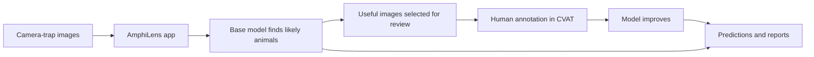

# AmphiLens

AmphiLens is a local browser app for finding amphibians and other wildlife in
camera-trap images. It helps conservation and ecology teams:

- find wildlife in large image collections;
- select useful images for human review;
- improve a model with a small amount of annotation; and
- download predictions, reports, and review images.

Your images stay on your computer unless you deliberately send a review queue
to a CVAT server or choose cloud training and approve uploading a labelled
dataset to Modal.

## What the app does



The active-learning step is based on the
[research paper](https://openreview.net/pdf?id=0YnE65NGna). It is most useful
when the new images are similar to the model's training domain.

## 1. Install AmphiLens

The supported first-release environment is Python 3.11. `uv` is recommended
because this project includes a lockfile with the tested dependency versions.

Open a terminal and move to the folder where you downloaded or cloned the
project. Replace the example path with your own location:

```bash
cd /path/to/amphilens
uv python install 3.11
uv sync --locked --python 3.11 \
  --extra cli --extra web --extra inference --extra training
```

For the managed CVAT workflow, include the CVAT extra:

```bash
uv sync --locked --python 3.11 \
  --extra cli --extra web --extra inference --extra training --extra cvat
```

For optional cloud GPU training, also include the cloud extra:

```bash
uv sync --locked --python 3.11 \
  --extra cli --extra web --extra inference --extra training --extra cloud
```

If `uv` is not available, use a normal Python virtual environment:

```bash
python3 -m venv .venv
source .venv/bin/activate
python -m pip install -e ".[cli,web,inference,training]"
```

On Windows PowerShell:

```powershell
py -m venv .venv
.\.venv\Scripts\Activate.ps1
python -m pip install -e ".[cli,web,inference,training]"
```

## 2. Keep project data separate from the source code

The AmphiLens checkout contains the application code. Your projects contain
images, annotations, checkpoints, predictions, and reports, so they are stored
separately by default in `~/Downloads/AmphiLens/projects`.

When creating a project, enter another location in **Project folder path** if
needed. AmphiLens blocks new project folders inside the source checkout so
generated files do not appear as Git changes.

To use a project you created earlier, open **Open project**, enter its folder
path, and press **Open project**. The selected project becomes active for
importing, training, prediction, and CVAT workflows.

AmphiLens remembers the last active project on this computer. Refreshing the
browser keeps the project open when its folder is still valid. Use **Close
active project** in the sidebar when you want to stop using it, then open
another project.

If an older project is already inside the source checkout, open it first and
use **Move and remove original**. AmphiLens copies and verifies the project
before removing the old folder. Your original camera-trap image folder is not
moved.

## 3. Start the browser app

Run:

```bash
uv run --locked amphilens doctor
uv run --locked amphilens app
```

Open [http://127.0.0.1:8501](http://127.0.0.1:8501) in your browser.

The **System health** page shows whether the computer has the libraries, disk
space, and GPU needed for the selected workflow.

## Optional: train on a cloud GPU

Cloud training sends the selected labelled snapshot and any selected base
checkpoint to your Modal account after you approve the upload and cost estimate.
It requires the `cloud` extra, Modal credentials, and a valid Modal payment
method. Open **Train a model**, save your Modal credentials in the masked fields
or run `amphilens cloud login`, then choose **Modal cloud GPU**. See the
[cloud training guide](docs/cloud-training.md) for privacy, cost, status,
cancellation, and cleanup details.

## 4. Create a project

In the app:

1. Open **Create project**.
2. Enter the path to the folder containing the camera-trap images.
3. Enter the wildlife classes as comma-separated names.
4. Accept the safe default project folder or enter another project path.
5. Press **Create project**.

The original image folder is never modified.

## 5. Import existing annotations

If you already labelled some images, open **Import images**. You can
choose the recommended direct CVAT workflow or use a local archive.

### Import directly from CVAT

1. Set `CVAT_URL` and `CVAT_TOKEN` before starting AmphiLens.
2. Choose **CVAT project**.
3. Press **Connect to CVAT**.
4. Select the CVAT project containing your initial annotations.
5. Review the labels and add a class mapping only when names differ.
6. Press **Import project**.

AmphiLens downloads the complete project, including all of its tasks and
images, through the CVAT API. You do not need to download a ZIP manually.

### Import a local archive

Choose **Local archive** and select an archive containing both images and
annotations. Supported formats are:

- CVAT for Images 1.1 ZIP;
- COCO 1.0 ZIP; and
- YOLO ZIP with `classes.txt` or `dataset.yaml`.

AmphiLens checks image files, dimensions, classes, and bounding boxes. Images
with no boxes are kept as reviewed negatives. The imported dataset becomes an
immutable snapshot, including the CVAT project and task provenance when the
API workflow is used.

## 6. Choose the model and image settings

The first supported model choices are:

- **YOLO26-L** — the default AmphiLens model;
- **RT-DETR-L**; and
- **Faster R-CNN with ResNet-50 FPN v2**.

For training, **General pretrained weights** remains the default. You can also
choose one of the three private AmphiLens fine-tuned models or a checkpoint
already saved in the current project. Choosing an AmphiLens model fixes that
run to its recorded architecture, size, preprocessing profile, and input size.

The AmphiLens models are hosted in the private
[`josh-salako/amphilens` Hugging Face repository](https://huggingface.co/josh-salako/amphilens).
Each computer that uses them needs the inference dependencies, a Hugging Face
CLI login (`hf auth login`), and read access to that repository. AmphiLens
downloads a selected checkpoint on first use into the standard Hugging Face
cache and reuses it later. The token remains in the user's local Hugging Face
configuration; it is not included in model requests or cloud-training uploads.
When using an AmphiLens model for prediction, map every source class to a project
class or choose **Ignore**. Exact class-name matches are preselected.

For each project, choose:

- maximum image dimension, default `640`;
- grayscale conversion, on by default;
- CLAHE, off for generic projects and on for the paper-aligned preset;
- confidence threshold; and
- CPU or CUDA device.

Images are resized without enlarging them, aspect ratio is preserved, and
grayscale images are replicated into three channels. If CLAHE is enabled,
resizing happens first to reduce processing time. These choices are saved in
the project and run metadata.

When you train or find wildlife, AmphiLens loads these saved choices
automatically. Open **Advanced run overrides** only when you intentionally want
different settings for one run. Those changes are recorded for that run and do
not change the project defaults.

If you select a trained checkpoint with a compatible `checkpoint.json`, its
model, classes, preprocessing, and detector input size take priority. AmphiLens
locks those settings and stops before running if they are incompatible with the
project.

## 7. Train a model or find wildlife

Use **Train a model** when you have imported labelled data. The initial imported
images are all used for training. AmphiLens does not invent a validation split;
until you provide a separate validation dataset, results say:
`evaluation: not evaluated`.

The training source starts as **General pretrained weights**. Select
**AmphiLens pretrained model** to initialize from one of the hosted checkpoints;
AmphiLens adapts the detector output head to the current project's target
classes while keeping compatible learned weights. **Existing project
checkpoint** continues from a checkpoint already registered in the project.

Use **Find wildlife** to run a selected base model or trained checkpoint over
an unlabeled image folder.

## 8. Improve the model with active learning

After inference:

1. Open **Choose images to review**.
2. Provide the prediction, calibration, and feature files.
3. Choose the number of images to review.
4. Press **Select annotation queue**.
5. Open **Annotation cycle** and select the generated `selection_queue.csv`.
6. Choose **Send a queue to CVAT** and press **Start cycle**.
7. Press **Open CVAT**, annotate and save every selected image.
8. Return to AmphiLens and press **Refresh status**.
9. When all CVAT jobs are complete, press **Continue cycle**.
10. Select the new immutable snapshot on **Train a model** and provide the
    parent checkpoint manifest to continue training.

For managed CVAT, set the server URL and token before starting the app. The
token is read only while the app is running:

```bash
export CVAT_URL="http://localhost:8080"
printf "CVAT token: "
read -r -s CVAT_TOKEN
printf "\n"
export CVAT_TOKEN
uv run --locked amphilens app
```

If CVAT is unavailable, use the portable CVAT or YOLO ZIP export/import
workflow instead.

## 9. Download the results

AmphiLens can produce:

- a CSV of image names, classes, confidence scores, and bounding boxes;
- a human-readable report;
- visual evidence images with detection boxes; and
- model checkpoints with configuration and provenance metadata.

## Hardware

CPU inference works for small and moderate collections. A CUDA GPU is strongly
recommended for fine-tuning and large collections. Model weights are downloaded
when first needed and are not included in the Python package.

## More information

- [Training and active learning](docs/training.md)
- [Canonical user workflows](docs/superpowers/specs/2026-09-28-amphilens-user-workflows.md)
- [Deployment options](docs/deployment.md)
- [Technical overview](docs/technical-overview.md)
- [Release checklist](docs/release-checklist.md)
- [Contributor guide](CONTRIBUTING.md)
- [Research paper](https://openreview.net/pdf?id=0YnE65NGna)

## License

AmphiLens application code is released under the
[GNU Affero General Public License v3.0 only](LICENSE). Hosted model files have
their own license status in the Hugging Face model card; Faster R-CNN's artifact
license is not established by the available training records.
