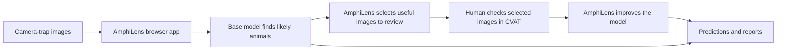

# AmphiLens

AmphiLens is a local browser app for finding amphibians and other wildlife in
camera-trap images. It helps a conservation or ecology team:

- scan a large image collection with a detection model;
- find the images that are most useful to label;
- improve the model with a small amount of human annotation; and
- download predictions, reports, and review images.

It is designed to work with sensitive wildlife data on the user's own
computer. A GPU is helpful for large collections and model training, but is
not required for basic inference.

## How it works



The selection step is the active-learning method described in the research
paper. It reduces the amount of annotation needed when the new images are
similar to the model's training domain.

## Run the app

AmphiLens runs locally on your computer. `uv` is the recommended installer
because this repository includes a lockfile with the tested dependency
resolution.

The supported first-release environment is Python 3.11. A committed
`uv.lock` records the reproducible dependency resolution.

### Recommended: install with uv

```bash
cd /Users/joshua/Downloads/wlt-app
uv python install 3.11
uv sync --locked --python 3.11 \
  --extra cli --extra ui --extra inference --extra training --extra cvat
uv run --locked amphilens doctor
uv run --locked amphilens app
```

The last command starts Streamlit. Open
[http://localhost:8501](http://localhost:8501) if the browser does not open
automatically. Use `uv run --locked amphilens app` rather than launching
`src/amphilens/ui.py` directly; the CLI preserves the package context required
by the browser app.

The `cvat` extra is only needed for the managed **Send to CVAT** workflow. If
you only need local inference and portable CVAT/YOLO ZIP import, use:

```bash
uv sync --locked --python 3.11 \
  --extra cli --extra ui --extra inference --extra training
```

### CVAT credentials

Managed CVAT needs a CVAT server URL and a personal access token. Set them in
the terminal before starting AmphiLens. This example prompts for the token so
it is not written directly into shell history:

```bash
export CVAT_URL="http://localhost:8080"
printf "CVAT token: "
read -r -s CVAT_TOKEN
printf "\n"
export CVAT_TOKEN
uv run --locked amphilens app
```

AmphiLens reads these values only while the app is running. It does not write
the token to project files, manifests, logs, CSV files, URLs, or Git. Remove it
from the current shell after closing the app with `unset CVAT_TOKEN`.

If CVAT is unavailable, leave the credentials unset and use the portable ZIP
import/export workflow instead.

### Alternative: pip installation

If `uv` is not available, the package can also be installed with pip:

```bash
python3 -m venv .venv
source .venv/bin/activate
python -m pip install -e ".[cli,ui,inference,training,cvat]"
amphilens app
```

On Windows PowerShell:

```powershell
py -m venv .venv
.\.venv\Scripts\Activate.ps1
python -m pip install -e ".[cli,ui,inference,training,cvat]"
amphilens app
```

The Streamlit messages about installing `streamlit skills` and `watchdog` are
optional recommendations, not required for AmphiLens. The watchdog package
can improve file-watching performance on some systems.

## Use the browser app

1. Check the environment and available hardware.
2. Create a project and choose the folder containing the camera-trap images.
3. Choose the wildlife classes, model, maximum image dimension, grayscale, and
   optional CLAHE settings.
4. If you already have labels, import a CVAT-for-Images or YOLO ZIP. The
   archive must include its images.
5. Train the initial model, or run the selected base model directly.
6. Review the active-learning queue and annotate the selected images in CVAT.
7. On **CVAT cycle**, press **Send to CVAT**, open the task, annotate and save,
   then return and press **Continue cycle**. AmphiLens checks completion,
   downloads the annotations, and merges a new dataset snapshot.
8. Select the new snapshot on **Train model** to continue from the parent
   checkpoint.
9. Download the predictions CSV, report, and visual evidence.

AmphiLens keeps source images unchanged. By default it downsizes only images
larger than 640 pixels on their longest side, preserves aspect ratio, converts
to three-channel grayscale, and leaves CLAHE off for generic projects. Every
choice is saved with the project and run.

For managed CVAT, install the pinned integration and set the server credentials
in the terminal before launching the app:

```bash
python -m pip install -e ".[cli,ui,inference,training,cvat]"
export CVAT_URL=http://localhost:8080
export CVAT_TOKEN='your-token-from-a-secret-store'
amphilens app
```

The token is used only by the running process and is never saved by AmphiLens.
If CVAT is unavailable, export/import a portable CVAT or YOLO ZIP instead.

## What you get

- A CSV containing image names, detected classes, confidence scores, and
  bounding boxes.
- A human-readable report and optional images with detection boxes drawn on
  them.
- A reproducible record of the model, settings, source images, and outputs.
- Reusable model checkpoints when fine-tuning is enabled.

## Hardware

CPU inference works for small or moderate collections. A CUDA GPU is strongly
recommended for fine-tuning and large collections. The app's **Environment**
page and `amphilens doctor` show the installed libraries, GPU status, and free
disk space before a run.

## Learn more

- [Research paper: Annotation-Efficient Object Detection of Endangered Western Leopard Toads](https://openreview.net/pdf?id=0YnE65NGna)
- [Technical overview](docs/technical-overview.md)
- [Local and Docker deployment](docs/deployment.md)
- [Fine-tuning notes](docs/training.md)
- [Contributor guide](CONTRIBUTING.md)

## Privacy and scope

In local mode, AmphiLens does not upload images. The project is broader than
Western Leopard Toads: it can support amphibians and other organisms when a
compatible model and labelled examples are available.

## License

AmphiLens is released under the [Apache License 2.0](LICENSE).
