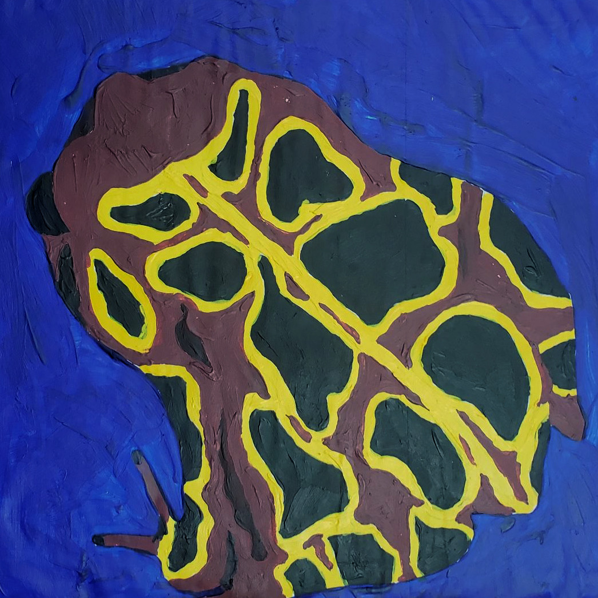
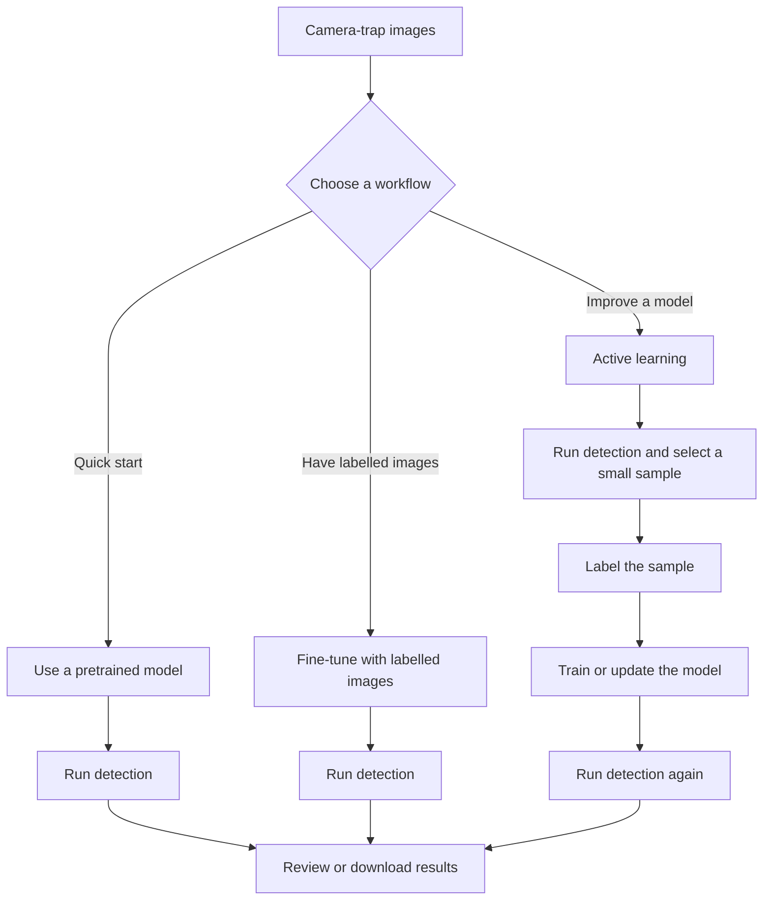

# AmphiLens

<p align="center">
  
</p>

AmphiLens is a local browser app for finding wildlife in camera-trap images and managing image review,
model training, and results.

## Choose a workflow



## Links

- [Pretrained models on Hugging Face](https://huggingface.co/josh-salako/amphilens)
- [Detection, fine-tuning, and active learning guide](docs/training.md)
- [Project paper](https://openreview.net/pdf?id=0YnE65NGna)

## Install and run

1. Clone this repo or download and unzip it.
2. Install [uv](https://docs.astral.sh/uv/getting-started/installation/). See the
   [uv GitHub repository](https://github.com/astral-sh/uv) for more information.
3. Open a terminal in the unzipped `amphilens` folder and run:

   ```bash
   uv python install 3.11
   uv sync --locked --python 3.11 --extra cli --extra web --extra inference --extra training
   ```

   uv manages Python 3.11 and installs the app's packages in a local `.venv` folder, so you do not
   need to install pip separately. See [uv's Python installation guide](https://docs.astral.sh/uv/guides/install-python/).

`uv sync` creates `.venv`. For CVAT or Modal, copy the example:

```bash
cp .env.example .env
```

Set the variables for the integrations you use:

- CVAT: Set `CVAT_URL` to your CVAT app URL (for a local server, `http://localhost:8080`). Create an API token in CVAT user settings and set it as `CVAT_TOKEN`.
- Modal: Create a token in the Modal dashboard. Set its ID as `MODAL_TOKEN_ID` and its secret as `MODAL_TOKEN_SECRET`.

`.env` is ignored by Git; do not commit credentials.

4. Start the app:

   ```bash
   uv run --locked amphilens app
   ```

5. Open [http://127.0.0.1:8501](http://127.0.0.1:8501) in your browser. Keep the terminal open
   while you use the app.

## Use AmphiLens

Choose **Create project** in the app and select the folder containing your images. AmphiLens keeps
project files and results separate from your original images. By default, projects are saved in
`~/Downloads/AmphiLens/projects`.

Your images stay on your computer unless you choose to send a review queue to CVAT or upload labelled
data for cloud training. A CPU can run predictions; a CUDA GPU is recommended for training and large
collections.

### Optional integrations

Add `--extra cvat` and/or `--extra cloud` to the `uv sync` command above for the integrations you use.

- **CVAT** is for annotating and reviewing images. The `cvat` extra installs AmphiLens's Python client, not the CVAT server. To run CVAT locally, follow [CVAT's Docker installation guide](https://docs.cvat.ai/docs/administration/community/basics/installation/), then start it from the CVAT directory with `docker compose up -d`. Open `http://localhost:8080` to create your account and API token.
- **Modal** runs training and prediction on cloud GPUs when you do not have suitable local hardware. Add `--extra cloud` and see the [cloud training guide](docs/cloud-training.md).

In AmphiLens, send an image queue to CVAT, annotate and save the images there, then return to AmphiLens to continue the cycle. Choose Modal cloud GPU to train or run predictions remotely. AmphiLens coordinates the handoff and tracks the cloud job; annotation is done in CVAT.

## License

The application code is released under [AGPL-3.0-only](LICENSE).
