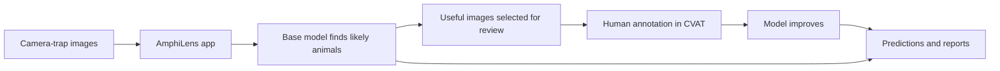

# AmphiLens

AmphiLens is a local browser app for finding amphibians and other wildlife in
camera-trap images. It helps conservation and ecology teams:

- find animals in large image collections;
- select useful images for human review;
- improve a model with a small amount of annotation; and
- download predictions, reports, and review images.

Your images stay on your computer unless you deliberately send a review queue
to a CVAT server.

## What the app does



The active-learning step is based on the
[research paper](https://openreview.net/pdf?id=0YnE65NGna). It is most useful
when the new images are similar to the model's training domain.

## 1. Install AmphiLens

The supported first-release environment is Python 3.11. `uv` is recommended
because this project includes a lockfile with the tested dependency versions.

Open a terminal and move to the folder where you downloaded or cloned the
project. Replace the example path with your own location:

```bash
cd /path/to/amphilens
uv python install 3.11
uv sync --locked --python 3.11 \
  --extra cli --extra ui --extra inference --extra training
```

For the managed CVAT workflow, include the CVAT extra:

```bash
uv sync --locked --python 3.11 \
  --extra cli --extra ui --extra inference --extra training --extra cvat
```

If `uv` is not available, use a normal Python virtual environment:

```bash
python3 -m venv .venv
source .venv/bin/activate
python -m pip install -e ".[cli,ui,inference,training]"
```

On Windows PowerShell:

```powershell
py -m venv .venv
.\.venv\Scripts\Activate.ps1
python -m pip install -e ".[cli,ui,inference,training]"
```

## 2. Start the browser app

Run:

```bash
uv run --locked amphilens doctor
uv run --locked amphilens app
```

Open [http://localhost:8501](http://localhost:8501) if the browser does not
open automatically.

The **Environment** page shows whether the computer has the libraries, disk
space, and GPU needed for the selected workflow.

## 3. Create a project

In the app:

1. Open **Create project**.
2. Choose the folder containing the camera-trap images.
3. Enter the animals or organisms to detect, one class per line.
4. Choose a project folder.
5. Press **Create project**.

The original image folder is never modified.

## 4. Import existing annotations

If you already labelled some images, open **Import initial dataset** and select
an archive containing both images and annotations.

Supported formats are:

- CVAT for Images 1.1 ZIP;
- COCO 1.0 ZIP; and
- YOLO ZIP with `classes.txt` or `dataset.yaml`.

Then:

1. Select the project folder.
2. Select the annotation ZIP file.
3. Add a class mapping only if the archive names differ from your project names.
4. Press **Import initial dataset**.

AmphiLens checks image files, dimensions, classes, and bounding boxes. Images
with no boxes are kept as reviewed negatives. The imported dataset becomes an
immutable snapshot.

## 5. Choose the model and image settings

The first supported model choices are:

- **YOLO26-L** — the default AmphiLens model;
- **RT-DETR-L**; and
- **Faster R-CNN with ResNet-50 FPN v2**.

For each project, choose:

- maximum image dimension, default `640`;
- grayscale conversion, on by default;
- CLAHE, off for generic projects and on for the paper-aligned preset;
- confidence threshold; and
- CPU or CUDA device.

Images are resized without enlarging them, aspect ratio is preserved, and
grayscale images are replicated into three channels. If CLAHE is enabled,
resizing happens first to reduce processing time. These choices are saved in
the project and run metadata.

## 6. Train a model or find animals

Use **Train model** when you have imported labelled data. The initial imported
images are all used for training. AmphiLens does not invent a validation split;
until you provide a separate validation dataset, results say:
`evaluation: not evaluated`.

Use **Find animals** to run a selected base model or trained checkpoint over
an unlabeled image folder.

## 7. Improve the model with active learning

After inference:

1. Open **Active learning queue**.
2. Provide the prediction, calibration, and feature files.
3. Choose the number of images to review.
4. Press **Select annotation queue**.
5. Open **CVAT cycle** and select the generated `selection_queue.csv`.
6. Press **Send to CVAT**.
7. Press **Open CVAT**, annotate and save every selected image.
8. Return to AmphiLens and press **Refresh status**.
9. When all CVAT jobs are complete, press **Continue cycle**.
10. Select the new immutable snapshot on **Train model** and provide the
    parent checkpoint manifest to continue training.

For managed CVAT, set the server URL and token before starting the app. The
token is read only while the app is running:

```bash
export CVAT_URL="http://localhost:8080"
printf "CVAT token: "
read -r -s CVAT_TOKEN
printf "\n"
export CVAT_TOKEN
uv run --locked amphilens app
```

If CVAT is unavailable, use the portable CVAT or YOLO ZIP export/import
workflow instead.

## 8. Download the results

AmphiLens can produce:

- a CSV of image names, classes, confidence scores, and bounding boxes;
- a human-readable report;
- visual evidence images with detection boxes; and
- model checkpoints with configuration and provenance metadata.

## Hardware

CPU inference works for small and moderate collections. A CUDA GPU is strongly
recommended for fine-tuning and large collections. Model weights are downloaded
when first needed and are not included in the Python package.

## More information

- [Training and active learning](docs/training.md)
- [Deployment options](docs/deployment.md)
- [Technical overview](docs/technical-overview.md)
- [Release checklist](docs/release-checklist.md)
- [Contributor guide](CONTRIBUTING.md)
- [Research paper](https://openreview.net/pdf?id=0YnE65NGna)

## License

AmphiLens is released under the [Apache License 2.0](LICENSE).
