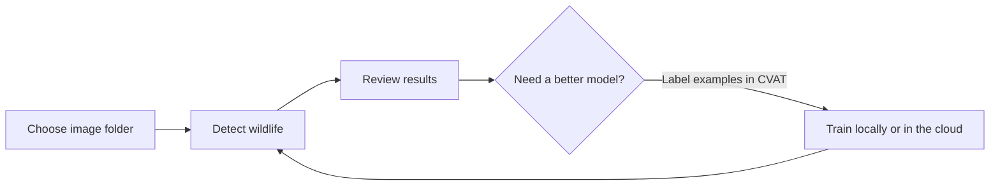

# AmphiLens

<p align="center">
  
</p>

AmphiLens is a local browser app for finding wildlife in camera-trap images, reviewing detections, and training models.

## Workflow



Guides: [training and annotation](docs/training.md) · [cloud jobs](docs/cloud-training.md) · [pretrained models](https://huggingface.co/josh-salako/amphilens) · [project paper](https://openreview.net/pdf?id=0YnE65NGna)

## Install

Clone or download the project. Install [uv](https://docs.astral.sh/uv/getting-started/installation/), open a terminal in the project folder, then run:

```bash
uv python install 3.11
```

Choose one setup:

```bash
# No local GPU; use Modal for cloud jobs
uv sync --locked --python 3.11 --extra cli --extra web --extra cloud

# Local NVIDIA GPU
uv sync --locked --python 3.11 --extra cli --extra web --extra local-cuda

# Mac with Apple Silicon / MPS (macOS 14+)
uv sync --locked --python 3.11 --extra cli --extra web --extra local-mps
```

For Azure or Google Cloud, use `cloud-azure` or `cloud-gcp` instead of `cloud`.

Linux file picker: install Zenity (`sudo apt install zenity` on Ubuntu/Debian, `sudo dnf install zenity` on Fedora, `sudo pacman -S zenity` on Arch, or `sudo zypper install zenity` on openSUSE).

**NVIDIA:** Use a supported GPU with its driver installed (580 or newer for CUDA 13); `nvidia-smi` should detect it. PyTorch supplies the CUDA runtime and cuDNN, so no separate CUDA Toolkit install is needed for inference ([driver compatibility](https://docs.nvidia.com/deploy/cuda-compatibility/minor-version-compatibility.html), [PyTorch guidance](https://discuss.pytorch.org/t/pytorch-finds-cuda-despite-nvcc-not-found/166754/2)).

## Run

```bash
uv run --locked amphilens app
```

Open [http://127.0.0.1:8501](http://127.0.0.1:8501).

## Projects and integrations

Choose **Create project** and select your image folder. Project files and results are saved separately from the originals, by default in `~/Downloads/AmphiLens/projects`. Images stay on your computer unless you send a review queue to CVAT or upload labelled data for cloud training.

For CVAT or Modal, create a local credentials file:

```bash
cp .env.example .env
```

Set `CVAT_URL` and `CVAT_TOKEN` for CVAT, or `MODAL_TOKEN_ID` and `MODAL_TOKEN_SECRET` for Modal. `.env` is Git-ignored; keep credentials private.

- **CVAT:** Add `--extra cvat` to your install command. This installs the AmphiLens client, not the CVAT server. [Install CVAT](https://docs.cvat.ai/docs/administration/community/basics/installation/) and start it with `docker compose up -d`.
- **Cloud:** The `cloud` install uses Modal for remote GPU jobs. See the [cloud guide](docs/cloud-training.md); Azure and Google Cloud options are listed above.

## License

[AGPL-3.0-only](LICENSE)
