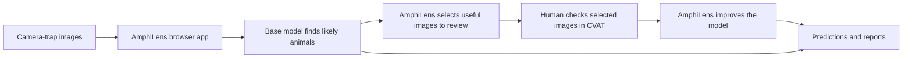

# AmphiLens

AmphiLens is a local browser app for finding amphibians and other wildlife in
camera-trap images. It helps a conservation or ecology team:

- scan a large image collection with a detection model;
- find the images that are most useful to label;
- improve the model with a small amount of human annotation; and
- download predictions, reports, and review images.

It is designed to work with sensitive wildlife data on the user's own
computer. A GPU is helpful for large collections and model training, but is
not required for basic inference.

## How it works



The selection step is the active-learning method described in the research
paper. It reduces the amount of annotation needed when the new images are
similar to the model's training domain.

## Run the app

AmphiLens currently runs locally from a Python environment. Copy these
commands into a terminal.

### macOS or Linux

```bash
python3 -m venv .venv
source .venv/bin/activate
python -m pip install -e ".[cli,ui,inference]"
amphilens app
```

### Windows PowerShell

```powershell
py -m venv .venv
.\.venv\Scripts\Activate.ps1
python -m pip install -e ".[cli,ui,inference]"
amphilens app
```

The app runs on your computer. Open [http://localhost:8501](http://localhost:8501)
if the browser does not open automatically.

## Use the browser app

1. Check the environment and available hardware.
2. Create a project and choose the folder containing the camera-trap images.
3. Choose the wildlife classes you want to detect and a compatible base model.
4. Run prediction on the image collection.
5. Review the active-learning queue and select images for annotation.
6. Use the portable CVAT exchange to annotate the selected images.
7. Import the completed annotations and use them for the next training cycle.
8. Download the predictions CSV, report, and visual evidence.

The current release provides portable CVAT export/import. The one-button CVAT
connection—create task, open CVAT, click Continue, import the annotations, and
continue training—is planned and documented in the
[implementation plan](docs/superpowers/plans/2026-09-25-amphilens-platform.md).

## What you get

- A CSV containing image names, detected classes, confidence scores, and
  bounding boxes.
- A human-readable report and optional images with detection boxes drawn on
  them.
- A reproducible record of the model, settings, source images, and outputs.
- Reusable model checkpoints when fine-tuning is enabled.

## Learn more

- [Research paper: Annotation-Efficient Object Detection of Endangered Western Leopard Toads](https://openreview.net/pdf?id=0YnE65NGna)
- [Technical overview](docs/technical-overview.md)
- [Local and Docker deployment](docs/deployment.md)
- [Fine-tuning notes](docs/training.md)
- [Contributor guide](CONTRIBUTING.md)

## Privacy and scope

In local mode, AmphiLens does not upload images. The project is broader than
Western Leopard Toads: it can support amphibians and other organisms when a
compatible model and labelled examples are available.

## License

AmphiLens is released under the [Apache License 2.0](LICENSE).
